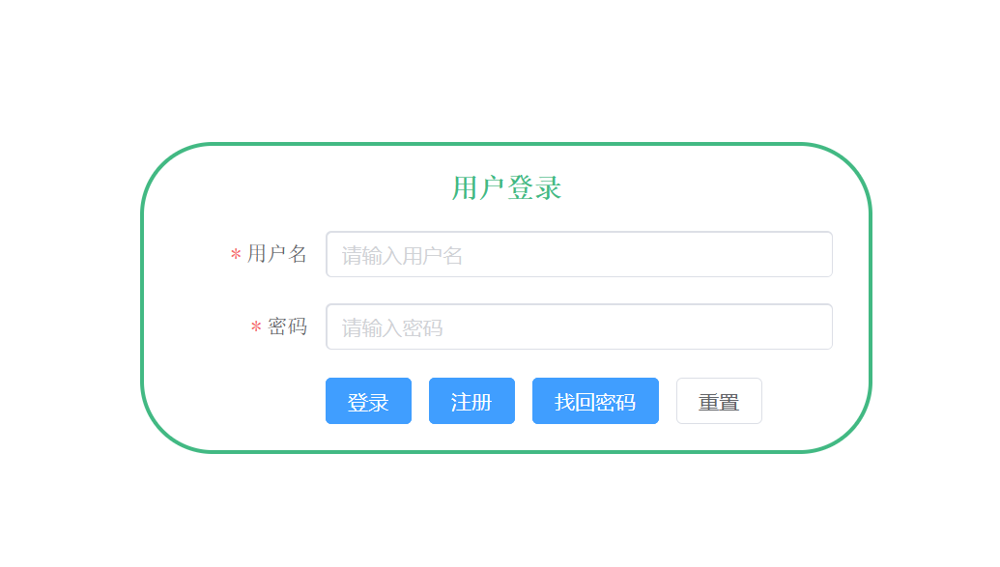
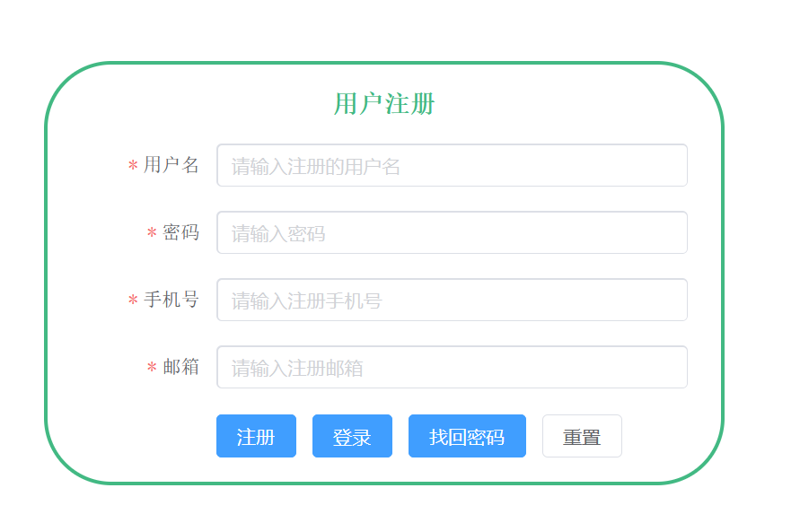
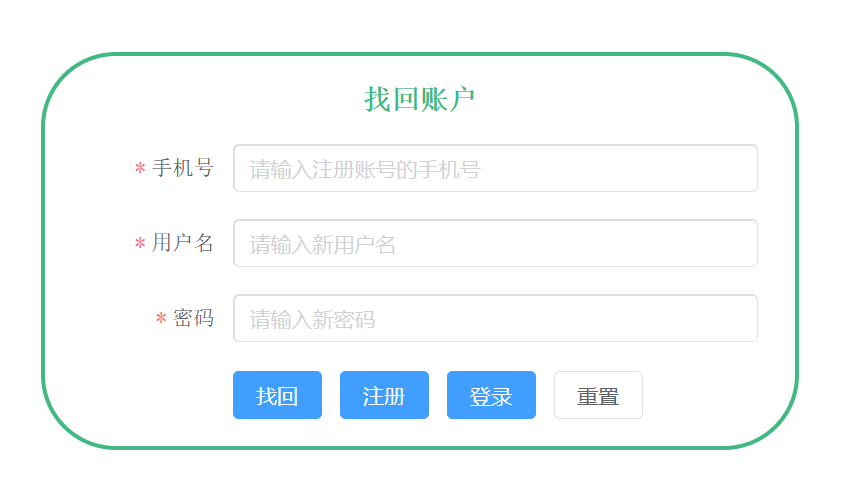
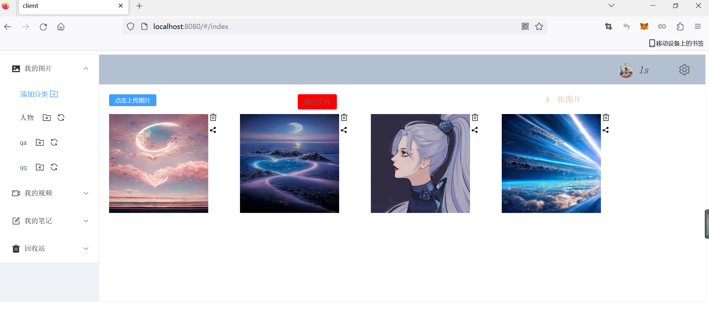
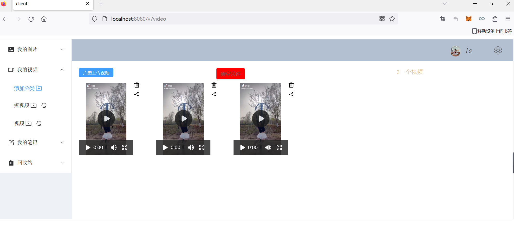
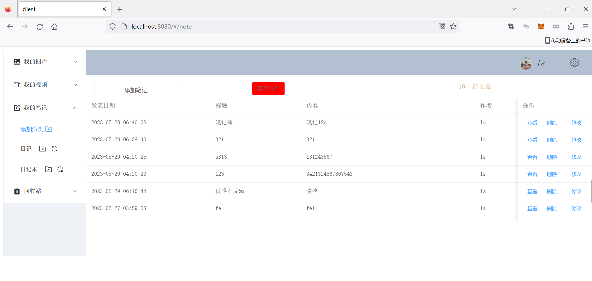
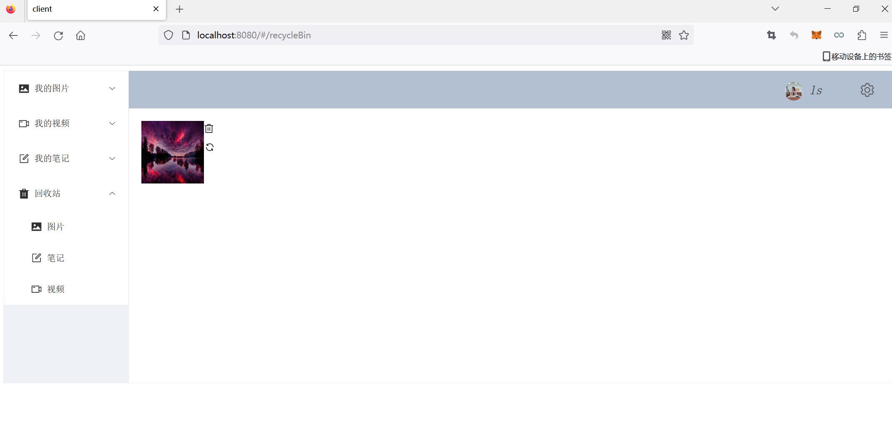

前端服务:Client
    项目启动:
    1、npm install
    2、npm run serve
后端服务:
    提供者
        image8001
        video8002
        note8003
    消费者
        image7001
        video7002
        note7003
    用户模块
        user8004
    网关模块
        gateway9999
    公共模块
        common

    项目启动:依次启动用户模块user8004、和三个提供者image8001、video8002、note8003、最后启动三个消费者image7001、video7002、note7003和网关服务gateway9999
登录

注册

找回密码

首页(图片)

(视频)

(笔记)

(回收站)

